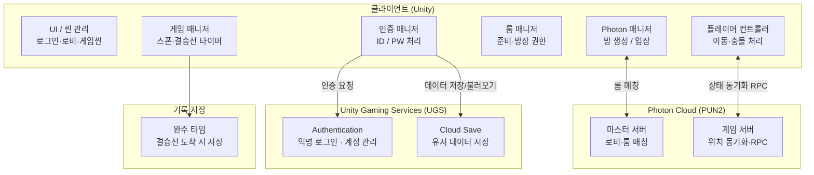
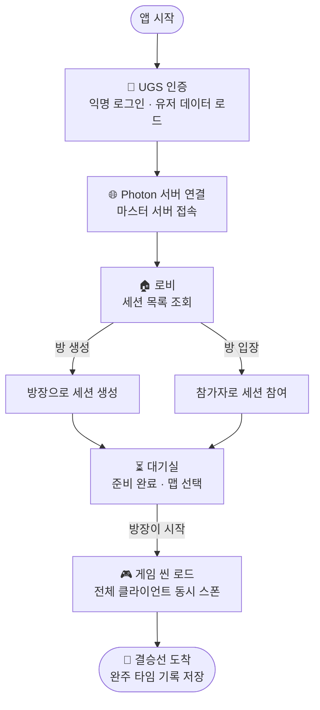

# 실시간 멀티플레이어 세션 관리 시스템

> 실시간 다중 클라이언트 동기화 및 세션 기반 사용자 관리를 구현한 캐주얼 멀티플레이 프로젝트

 

## 📌 프로젝트 개요

| 항목 | 내용 |
|------|------|
| 개발 언어 | C# |
| 개발 도구 | Unity |
| 플랫폼 | PC (Windows) |
| 개발 기간 | 2025.01.06 ~ 2025.02.05 (약 4주) |
| 팀 구성 | 5인 (팀장 1, 개발 2, 기획·디자인 2) |
| 핵심 기술 | Unity, C#, Photon PUN2, Unity Gaming Services (UGS) |

 

## 🎯 개발 목적

단순한 게임 구현을 넘어, **실시간 네트워크 환경에서의 다중 클라이언트 상태 동기화**와 **세션 기반 사용자 그룹 관리** 구조를 직접 설계하고 구현하는 것을 목표로 했습니다.

- 실시간 다중 클라이언트 동기화 구조 설계 (Photon PUN2 기반)
- 세션 단위 사용자 그룹 매핑 및 입장 로직 구현
- Unity Gaming Services (UGS) Authentication · Cloud Save를 활용한 계정 및 데이터 관리 연동
- 객체 생명주기 관리 및 게임 루프 제어 구조 구현
- 싱글톤 패턴 기반 매니저 클래스 설계 (UI, Sound)

 

## 🕹️ 프로젝트 소개

장애물을 회피하며 결승점에 도달하는 캐주얼 경쟁 게임입니다.
여러 클라이언트가 하나의 세션에 접속해 실시간으로 상태를 공유하며, 각자의 완주 타임이 기록됩니다.

**주요 흐름**
- UGS 계정 인증 → Photon 서버 연결 → 로비에서 세션 생성 또는 참여
- 방장(Host)이 맵을 선택하고 게임 시작 → 모든 클라이언트 동시 스폰
- 결승선 도달 시 완주 타임 저장

 

## 🏗️ 시스템 아키텍처

 

## 🔄 게임 플로우

%%{init: {'theme': 'default', 'flowchart': {'nodeSpacing': 30, 'rankSpacing': 40}}}%%

 

## 👤 담당 역할

**팀장 / PM**
- 전체 기획 수립, 일정 관리, 팀원 간 역할 분배 및 진행 조율
- 테스트 계획 수립 및 피드백 취합·반영

**게임 로직 개발**
- 맵 구조 기획 및 레벨 디자인 (장애물 배치, 구간 설계)
- 상호작용 오브젝트 개발 (트리거, 이벤트 처리)
- 캐릭터 리스폰 로직 및 게임 루프 제어 구현 (C#)
- 싱글톤 패턴 기반 UI 매니저 / 사운드 매니저 구현

> 네트워크 동기화(Photon PUN2) 파트는 별도 팀원이 담당했으며,  
> 저는 게임 로직·UI·씬 전환 등 클라이언트 사이드 구현에 집중했습니다.

 

## 🛠️ 기술 스택

| 분류 | 기술 |
|------|------|
| 언어 | C# |
| 엔진 | Unity |
| 네트워크 | Photon PUN2 (실시간 상태 동기화, RPC) |
| 인증 / 저장 | Unity Gaming Services — Authentication, Cloud Save |
| 버전 관리 | Git / GitHub |

 

## 💡 트러블슈팅 / 배운 점

**UGS 기반 인증 및 클라우드 저장 구조 이해**  
Unity Gaming Services의 `Authentication` + `Cloud Save` 조합으로 익명 로그인 후 유저 데이터를 클라우드에 저장·불러오는 구조를 파악했습니다. 이는 Firebase의 Auth + Firestore 조합과 개념적으로 동일한 패턴으로, 클라우드 기반 사용자 데이터 관리의 기본 흐름을 이해하게 되었습니다.

**팀 협업에서의 역할 분리**  
네트워크·인증 모듈과 게임 로직 모듈을 명확히 분리해 병렬 개발을 진행했습니다. 인터페이스 기준을 먼저 합의하고 각자 구현하는 방식으로 의존성 충돌을 최소화했습니다.

**매니저 클래스 설계**  
UI와 사운드를 싱글톤 매니저로 분리함으로써 씬 전환 시 상태 유지 및 재사용성을 확보했습니다. 이 구조는 일반 애플리케이션의 서비스 레이어 설계와 유사한 패턴임을 인식했습니다.
